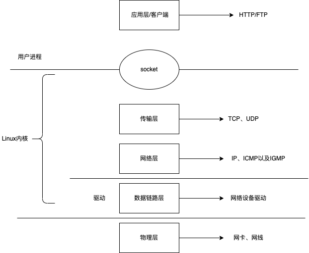
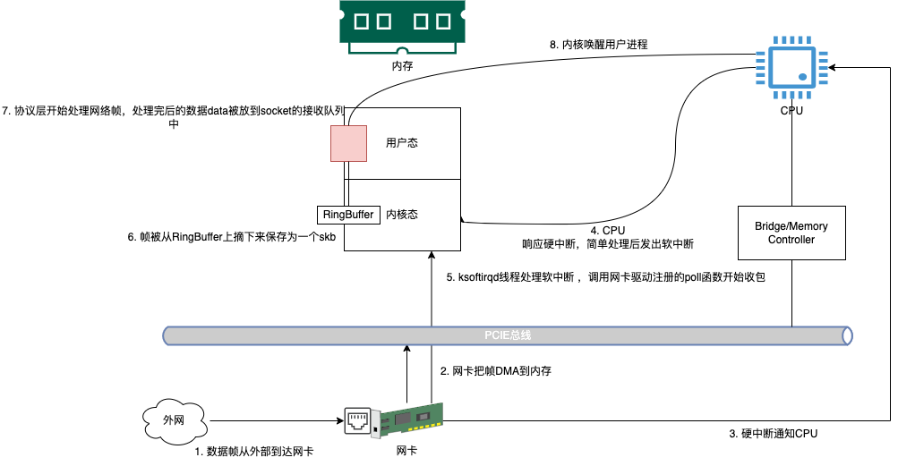

## linux网络收包总览

如同上图，`TCP/IP`网络分层模型中，整个协议栈被分成为了
- 物理层
- 数据链路层
- 网络层
- 传输层
- 应用层

应用层主要是（比如`Nginx`，`FTP`等应用），`linux`内核以及网卡驱动主要实现链路层、网络层以及传输层这三层的功能
内核为更上面的应用层提供`socket`接口来支持用户的进程访问

在`linux`源码中，
- 网络设备的驱动对应的逻辑位于`driver/net/ethernet`
  - 其中`intel`系列网卡的驱动在`driver/net/ethernet/intel`目录下
- 协议栈代码位于`kernel`以及`net`目录下

内核和网络设备驱动 是通过中断方式来处理的
- 当设备上有数据到达时，会给 `CPU`相关引脚触发一个电压变化，来通知`CPU`来处理数据。
- 对于网络模块来说，由于处理过程比较复杂以及耗时，
  - 如果在中断函数中完成了所有的处理，将会导致中断处理函数（优先级过高）过度占用`CPU`，使得`CPU`无法响应其他设备，比如鼠标、键盘的消息
因此基于此，`Linux`**中断函数**分为上、下两个半部的
- 上半部只进行最简单的工作，快速处理然后释放`CPU`，接着`CPU`允许其他中断进来
- 下半部分做绝大多数的工作，相当缓慢、从容的去处理

在2.4以后的`linux`内核版本采用下半部实现由**软中断**，由`ksoftirqd`内核线程全权去处理，
- **硬中断**是通过`CPU`物理引脚施加电压变化来实现的，
- 而**软中断**是通过给内存中的变量赋予二进制值来标记有软中断发生

内核收包路径示意图

> 1. 数据帧从外部网络到达网卡
> 2. 网卡把数据帧DMA到内存 （DMA直接内存存取）
> 3. 硬中断通知CPU
> 4. CPU响应硬中断，简单处理后发出软中断
> 5. ksoftirqd线程处理软中断，调用网卡驱动注册的poll函数开始收包
> 6. 数据帧被从`RingBuffer`上摘下保存在一个`skb`
> 7. 协议层开始处理网络数据帧，处理完后的数据`data`被放到`socket`的接收队列中
> 8. 内核唤醒用户进程

当网卡收到数据以后，以`DMA`方式把网卡收到的帧写到内存里，再向`CPU`发起一个中断，以通知`CPU`有数据到达
当`CPU`收到中断请求后，会调用网络设备驱动注册的中断处理函数。
网卡的中断处理函数并不做过多工作，发起软中断请求，然后尽快释放`CPU`资源。
`ksoftirqd`内核线程检测有软中断请求到达，调用`poll`开始轮询收包，收到后交由协议栈处理，对于`TCP`包来说，它被放到用户的`Socket`接收队列中.