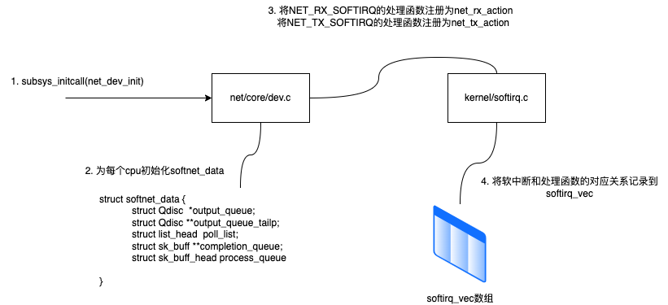
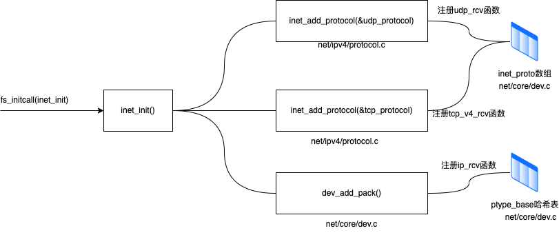

## linux启动准备工作

`linux`驱动、内核协议栈等模块在能够接收网卡数据包之前，要做很多准备工作才行，包括
1. 提前创建好`ksoftirqd`内核线程
2. 注册好各个协议对应的处理函数
3. 网卡设备子系统要提前初始化好
4. 网卡启动好
以上准备工作做好后，才开始真正的接收数据包


### 创建`ksoftirqd`内核线程

`linux`的软中断都是在专门的内核线程(`ksoftirqd`)中进行的，线程数量等于你服务器的核心数，初始化后，才能在后面更准确了解收包过程

`ksoftirqd`创建： 系统初始化的时候，会执行到`spawn_ksoftirqd`（位于`kernel/softirq.c`)来创建出`softirqd`线程

1. 启动 --> kernel/smpboot.c --> 2. spawn内核线程ksoftirqd --> kernel/softirq.c --> 3.注册线程函数`ksoftirqd_should_run`, `run_ksoftirqd`

代码如下:

```C

//file: kernel/softirq.c
static struct smp_hotplug_thread softirq_threads = {
    .store = &ksoftirqd,
    .thread_should_run = ksoftirqd_should_run,
    .thread_fn = run_ksoftirqd,
    .thread_comm = "ksoftirqd/%u",
};

static __init int spawn_ksoftirqd(void)
{
    register_cpu_notifier(&cpu_nfb);
    BUG_ON(smpboot_register_percpu_thread(&softirq_threads));
    return 0;
}
early_initcall(spawn_ksoftirqd);
```

`ksoftirqd`被创建出来后，它就会进入自己的线程循环函数`ksoftirqd_should_run`和`run_ksoftirqd`了，接下来判断有没有软中断需要处理

`linux`内核在`interrupt.h`中定义了所有的软中断类型，网络软中断只是其中一个，具体如下

```C

// file: include/linux/interrupt.h

enum 
{
    HI_SOFTIRQ = 0,
    TIMER_SOFTIRQ,
    NET_TX_SOFTIRQ,
    NET_RX_SOFTIRQ,
    BLOCK_SOFTIRQ,
    BLOCK_IOPOLL_SOFTIRQ,
    TASKLET_SOFTIRQ,
    SCHED_SOFTIRQ,
    HRTIMER_SOFTIRQ,
    RCU_SOFTIRQ,
    NR_SOFTIRQS
};
```

### 网络子系统初始化

在网络子系统初始化过程中，会为每个`CPU`初始化`softnet_data`，也会为`RX_SOFTIRQ`和`TX_SOFTIRQ`注册处理函数，流程图如下



内核通过调用`subsys_initcall`来初始化各个子系统，在源代码目录里可以用`grep`命令搜索出许多对这个函数的调用，这里要说的是网络子系统的初始化，会执行`net_dev_init`函数

```C
// file: net/core/dev.c

static int __init net_dev_init(void) 
{
    for_each_possible_cpu(i) {
        struct softnet_data *sd = &per_cpu(softnet_data, i);
        memset(sd, 0, sizeof(*sd));
        skb_queue_head_init(&sd->input_pkt_queue);
        skb_queue_head_init(&sd->process_queue);
        sd->completion_queue = NULL;
        INIT_LIST_HEAD(&sd->poll_list);
        ...
    }
    open_softirq(NET_TX_SOFTIRQ, net_tx_action);
    open_softirq(NET_RX_SOFTIRQ, net_rx_action);

}

subsys_initcall(net_dev_init);
```

在这个函数中，会为每个`CPU`都申请一个`softnet_data`数据结构，这个数据结构里的`poll_list`用于等待驱动程序将其`poll`函数注册进来
稍后网卡驱动程序初始化的时候可以看到这一过程
另外，`open_softirq`会为每一种软中断都注册一个处理函数，`NET_TX_SOFTIRQ`的处理函数为`net_tx_action`，`NET_RX_SOFTIRQ`的处理函数为`net_rx_action`
继续跟踪`open_softirq`后会发现这个注册的方式记录在`softirq_vec`变量中的。后面`ksoftirqd`线程收到软中断的时候，也会使用这个变量来找到每个软中断对应的处理函数

```C
// file: kernel/softirq.c
void open_softirq(int nr, void(*action)(struct softirq_action *)) 
{
    softirq_vec[nr].action = action;
}
```


### 协议栈注册

内核实现了网络层的`IP`协议，也实现了传输层的`TCP`和`UDP1`协议，这些协议对应的实现函数分别是
1. `ip_rcv()`
2. `tcp_v4_rcv()`
3. `udp_v4_rcv()`
和平时代码方式不同的是，内核是通过注册方式来实现的
`linux`内核中的`fs_initcall`和`subsys_initcall`类似，就是初始化模块的入口
`fs_initcall`调用`net_init`后开始网络协议栈注册，通过`inet_init`，将这些函数注册到`inet_protos`和`ptype_base`数据结构中，如图



相关代码如下:

```C
// file: net/ipv4/af_inet.c
static struct packet_type ip_packet_type __read_mostly = {
    .type = cpu_to_be16(ETH_P_IP),
    .func = ip_rcv,
};
static const struct net_protocol udp_protocol = {
    .handler = udp_rcv,
    .err_handler = udp_err,
    .no_policy = 1,
    .netns_ok = 1,
};
static const struct net_protocol tcp_protocol = {
    .early_demux = tcp_v4_early_demux,
    .handler = tcp_v4_rcv,
    .err_handler = tcp_v4_rcv,
    .no_policy = 1,
    .netns_ok = 1,
};
static int __init inet_init(void) 
{
    ......
    if (inet_add_protocol(&icmp_protocol, IPPROTO_ICMP) < 0)
        pr_crit("%s: cannot add ICMP protocol\n", __func__)
    if (inet_add_protocol(&udp_protocol, IPPROTO_UDP) < 0)
        pr_crit("%s: cannot add UDP protocol\n", __func__)
    if (inet_add_protocol(&tcp_protocol, IPPROTO_TCP) < 0)
        pr_crit("%s: cannot add TCP protocol\n", __func__)
    ......
    dev_add_pack(&ip_packet_type);
}

```

从上面代码看到，`udp_protol`结构体的`handler`是`udp_rcv`，`tcp_protol`结构体的`handler`是`tcp_v4_rcv`，他们通过`inet_add_protocol`函数被初始化进来

```C
// file: net/ipv4/protocol.c

int inet_add_protocol(const struct net_protocol *prot, unsigned char protocol)
{   
    if(!prot->netns_ok) {
        pr_err("Protocol %u is not namespace aware, cannot register\n",protocol);
        return -EINVAL;
    }  
    return !cmpxchg((const struct net_protocol **)&inet_protos[protocol], NULL, prot) ?0:-1;
}
```

`inet_add_protocol`函数将`TCP`和`UDP`对应的处理函数都注册到`inet_protocol`数组中了，再看`dev_add_pack(&ip_packet_type);`这一行，
`ip_packet_type`结构体中的`type`是协议名称，`func`是`ip_rcv`函数，它们在`dev_add_pack`中会被注册到`ptype_base`哈希表中


```C
// file: net/core/dev.c
void dev_add_pack(struct packet_type *pt)
{
    struct list_head *head = ptype_head(pt);
    ......

}
static inline struct list_head *ptype_head(const struct packet_type *pt)
{
    if (pt->type == htons(ETH_P_ALL))
        return &ptype_all;
    else 
        return &ptype_base[ntohs(pt->type) & PTYPE_HASH_MASK];
}
```

这里要记住`net_protos`记录着`TCP`，`UDP`处理的函数地址，`ptype_base`存储着`ip_rcv()`函数的处理地址。
软中断中会通过`ptype_base`找到`ip_rcv`函数地址，进而将`IP`包正确的送到`ip_rcv`中执行。
在`ip_rcv`中将会通过`inet_protos`找到`TCP`或者`UDP`进而处理函数，再把包转发给`udp_rcv()`或者`tcp_v4_rcv()`函数

扩展下，如果看一下`ip_rcv`和`udp_rcv`等函数的代码， 能看到很多协议处理过程，例如，`ip_rcv`会处理`iptables netfilter`过滤，`udp_rcv`中会判断`socket`接收队列是否满，对应的相关内核参数是`net.core_rmem_max`和`net.core.rmem_default`